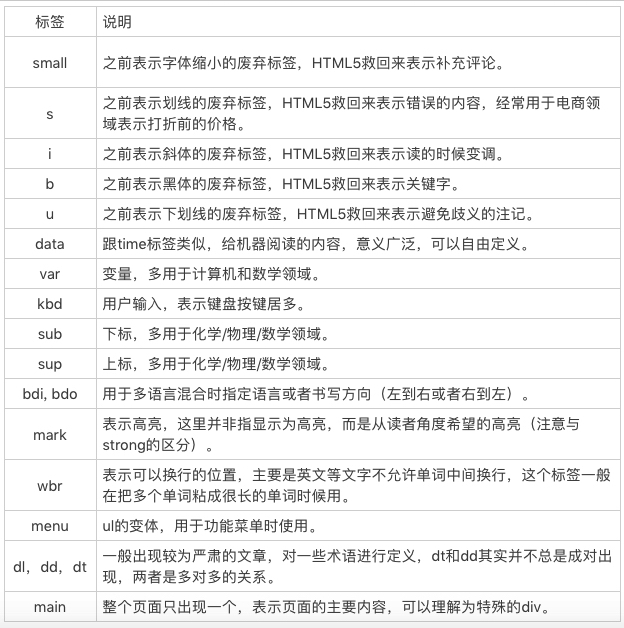

# 重学前端


### 知识体系

- JavaScript 语言


> 用一定的词法和语法，表达一定语义，从而操作运行时。

- CSS 和 HTML


- 浏览器的实现原理和 API和 API


- 前端工程实践


### HTML语义

- 标签语义化
    - 用对”比“不用”好，“不用”比“用错”好
    - 表达一定的结构 (`<ruby>、<rt>、<rp>`)
    - 划重点 (`<em>、<strong>`)

#### 标签

- 三个跟引述相关的标签
    - `<blockquote>`<blockquote> 表示段落级引述内容 </blockquote>
    - `<q>` 表示行内的引述内容
    - `<cite>` 表示引述的作品名
    - `<figure>` 表示与主文章相关的图像、照片等流内容
    - `<figcaption>` 表示内容的标题
    - `<dfn>` 用来包裹被定义的名词
    - `<ol>` 和 `<ul>` 的区分是内容是否有顺序关系
    - `<pre>` 表示这部分内容是预先排版过的，不需要浏览器进行排版
    - `<samp>` 计算机程序的示例输出
    - `<code>` 代码
    - `<time>` 时间


### JS类型 (弱类型语言)

#### 七种类型

- `Undefined` 未定义
- `Null` 定义了但是为空
- `Boolean`
- `Number`
    > NaN，占用了 9007199254740990，这原本是符合 IEEE 规则的数字；<br/>
    > Infinity，无穷大；<br/>
    > -Infinity，负无穷大。<br/>
    > Math.abs(0.1 + 0.2 - 0.3) <= Number.EPSILON); 检查等式左右两边差的绝对值是否小于最小精度，才是正确的比较浮点数的方法。
- `String` 字符串的 UTF16 编码`
    > 字符串的最大长度，实际上是受字符串的编码长度影响的。<br/>
    > Note：现行的字符集国际标准，字符是以 Unicode 的方式表示的，每一个 Unicode 的码点表示一个字符，理论上，Unicode 的范围是无限的。<br/>
    > UTF 是 Unicode 的编码方式，规定了码点在计算机中的表示方法，常见的有 UTF16 和 UTF8。<br/>
    > Unicode 的码点通常用 U+??? 来表示，其中 ??? 是十六进制的码点值。 0-65536（U+0000 - U+FFFF）的码点被称为基本字符区域（BMP）。<br/>
- `Object` 属性的集合
- `Symbol` 一切非字符串的对象 key 的集合

#### 类型转换


- StringToNumber
    > parseInt 都建议传入第二个参数 <br/>
    > parseFloat 直接把原字符串作为十进制来解析 <br/>
    > Number 是比 parseInt 和 parseFloat 更好的选择
- 装箱转换 `把基本类型转换为对应的对象`
    ```
    var symbolObject = (function(){ return this; }).call(Symbol("a"));
    console.log(typeof symbolObject); //object
    console.log(symbolObject instanceof Symbol); //true
    console.log(symbolObject.constructor == Symbol); //true
    ```
    > 装箱机制会频繁产生临时对象，在一些对性能要求较高的场景下，我我们应该尽量避免对基本类型做装箱转换。
- 拆箱转换
    > 尝试调用 valueOf 和 toString 来获得拆箱后的基本类型，无则返回错误TypeError
    > ES6后，ToPrimitive 函数，它是对象类型到基本类型的转换
- typeof
    > typeof null === Object <br/>
    > typeof function() {} === Object

    